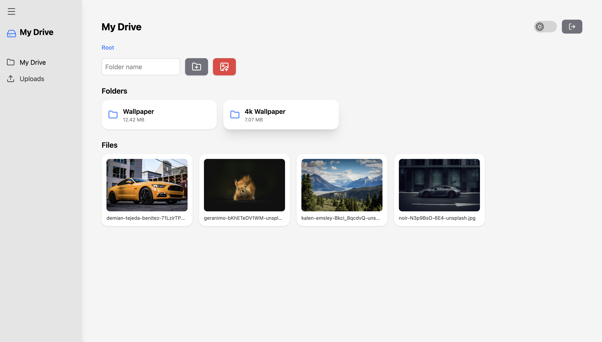
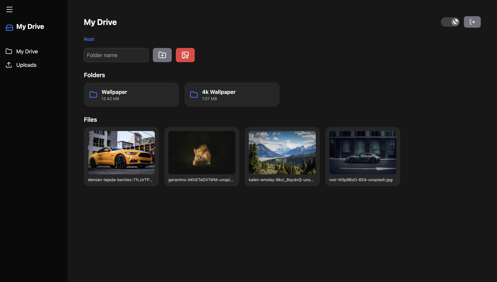

# 🚀 Full Stack Drive (File Management System)

A modern **Google Drive-like file management system** built with a full-stack architecture using **React, Node.js, MongoDB, and Cloudinary**.

👉 Live Demo: https://dobby-ads-assignment-psi.vercel.app  
👉 Backend API: https://dobby-ads-assignment-1pry.onrender.com  
👉 GitHub: https://github.com/smttomar

---

## ✨ Features

### 🔐 Authentication

- User Registration & Login
- JWT-based authentication
- Protected routes (Dashboard access control)

### 📁 Folder Management

- Create nested folders
- Breadcrumb navigation
- Folder size calculation

### 🖼️ File Upload System

- Upload images to Cloudinary
- View files inside folders
- Image preview modal (with blur + animation)

### 🌗 Dark Mode & Theme System

- System-based theme detection (OS sync)
- Manual toggle (🌞 / 🌙 slider)
- Persistent theme using localStorage
- Real-time theme update on system change
- Built using Tailwind CSS v4

### 🎨 UI/UX (Premium Level)

- Google Drive inspired UI
- Collapsible sidebar
- Loading spinners (login, upload, logout)
- Toast notifications (react-hot-toast)
- Smooth animations & hover effects
- Custom modals for rename and delete actions
- Circular action buttons with hover interactions
- Smooth animations and transitions
- Improved user experience for file and folder operations

### ⚡ Performance & Deployment

- Cloudinary for scalable file storage
- Deployed on Vercel (frontend) & Render (backend)
- Optimized API structure

### 🛠️ Advanced File & Folder Management

- Rename folders using a custom modal (no browser prompt)
- Delete folders with confirmation modal
- Delete files with confirmation modal
- Prevents accidental data loss
- Full CRUD operations implemented

---

## 🤖 MCP API Endpoints (AI Integration)

This project includes a basic **MCP (Model Context Protocol)-style endpoint** to allow AI systems to interact with backend functionality.

### 🔗 Endpoint

POST /api/mcp

### 📦 Supported Actions

#### 1. Create Folder

```json
{
    "action": "create_folder",
    "name": "Projects"
}
```

#### 2. Get Files

```json
{
    "action": "get_files"
}
```

#### 3. Get Folders

```json
{
    "action": "get_folders"
}
```

### 🧠 Description

This endpoint acts as a **tool interface** where structured commands can trigger backend operations.
It enables future integration with AI assistants (e.g., Claude, ChatGPT tools).

---

## 🛠️ Tech Stack

### Frontend

- React (Vite)
- Tailwind CSS
- React Router
- Axios
- React Hot Toast
- Lucide Icons

### Backend

- Node.js
- Express.js
- MongoDB (Mongoose)
- JWT Authentication
- Multer + Cloudinary

### Deployment

- Vercel (Frontend)
- Render (Backend)
- MongoDB Atlas (Database)
- Cloudinary (File Storage)

---

## 📂 Project Structure

```
project-root/
│
├── frontend/         # React App (Vite)
│   ├── src/
│   └── components/
│
├── backend/          # Node.js API
│   ├── controllers/
│   ├── models/
│   ├── routes/
│   └── middleware/
│
└── README.md
```

---

## ⚙️ Setup Instructions

### 1️⃣ Clone Repository

```bash
git clone https://github.com/smttomar
cd your-project
```

---

### 2️⃣ Backend Setup

```bash
cd backend
npm install
```

Create `.env`:

```env
MONGO_URI=your_mongodb_uri
JWT_SECRET=your_secret

CLOUD_NAME=your_cloud_name
CLOUD_API_KEY=your_api_key
CLOUD_API_SECRET=your_api_secret
```

Run backend:

```bash
npm start
```

---

### 3️⃣ Frontend Setup

```bash
cd frontend
npm install
npm run dev
```

---

🔐 Demo Credentials

Email: testuser@gmail.com  
Password: smt@18

---

## 🌍 Environment Variables

### Backend

- MONGO_URI
- JWT_SECRET
- CLOUD_NAME
- CLOUD_API_KEY
- CLOUD_API_SECRET

---

## 📸 Screenshots





---

## 🧠 Key Learnings

- Handling **file uploads in production (Cloudinary)**
- Solving **deployment issues (Vercel routing + Render storage)**
- Implementing **protected routes & auth flow**
- Building **scalable full-stack architecture**
- Improving **UX with loaders, toasts, and animations**

---

## 🚀 Future Improvements

- File delete & rename
- Drag & drop upload
- File sharing via link
- Search & filter system

---

## 👨‍💻 Author

**Chandra Pratap Singh**  
🔗 GitHub: https://github.com/smttomar

---

## ⭐ Show Your Support

If you like this project, give it a ⭐ on GitHub!

---
